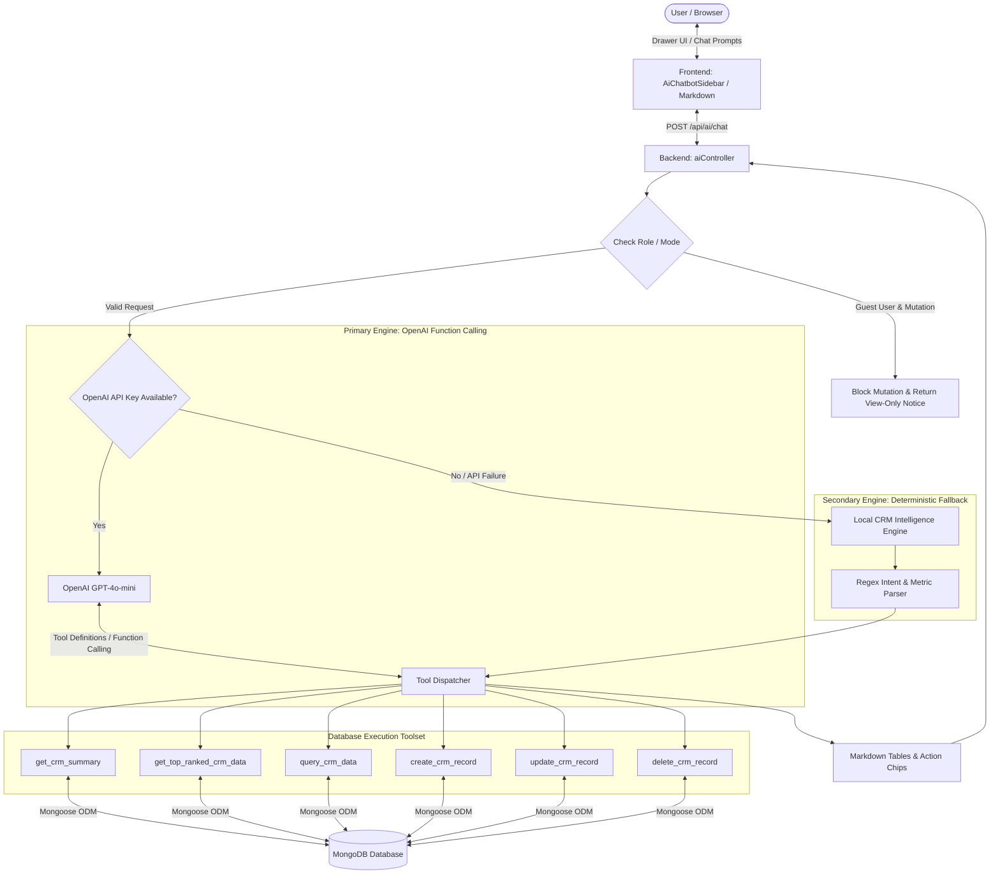

<div align="center">
  <h1>💼 MyCRM</h1>
  <p><b>Enterprise-Ready Cloud CRM, ERP & Sales Management Platform with AI Copilot</b></p>

  [](https://nodejs.org/)
  [](https://react.dev/)
  [](https://vitejs.dev/)
  [](https://ant.design/)
  [](https://www.mongodb.com/)
  [](https://www.docker.com/)
  [](https://traefik.io/)
  [](https://openai.com/)
  [](https://opensource.org/licenses/MIT)

  <p>
    <a href="https://mycrm.sequenceit.software"><b>🌐 Live Application</b></a> •
    <a href="#-features">Features</a> •
    <a href="#-ai-architecture--copilot-engine">AI Architecture</a> •
    <a href="#-technology-stack">Tech Stack</a> •
    <a href="#-quick-start-local-development">Quick Start</a> •
    <a href="#-traefik--docker-deployment">Docker Deployment</a> •
    <a href="#-cicd-pipeline">CI/CD</a>
  </p>
</div>

---

## 🌟 Overview

**MyCRM** is a modern, high-performance Customer Relationship Management (CRM) and Enterprise Resource Planning (ERP) platform built on the modern MERN stack (**Node.js 22, Express, MongoDB, React 18, Vite 5, Redux Toolkit, and Ant Design 5**).

Designed for growing businesses, freelancers, and enterprise sales teams, MyCRM provides end-to-end sales lifecycle tracking—from lead capture and quotation to automated PDF invoicing, multi-mode payment collection, expense management, and executive analytics. It also features an advanced **Dual-Engine AI Copilot** capable of real-time database querying, analytical rankings, and natural-language record management.

- **Production URL**: [https://mycrm.sequenceit.software](https://mycrm.sequenceit.software)
- **Source Repository**: [https://github.com/sequenceit-git/MyCRM.git](https://github.com/sequenceit-git/MyCRM.git)

---

## ✨ Features

### 📊 Executive Analytics & Dashboard
- **Real-Time Financial KPIs**: Instant visibility into *Gross Invoiced Amount*, *Collected Revenue*, *Outstanding Unpaid Invoices*, *Active Quotes Pipeline*, *Operating Expenses*, and *Net Operating Income*.
- **Dynamic Date Range Filters**: Instantly scope metrics by *Yesterday*, *Last Week*, *Last Month*, *Last Year*, or *From Beginning*.
- **Performance Progress Bars**: Live status breakdowns for Invoices, Quotes, and Collection Efficiency rates.
- **Circular Customer Gauge**: Visual active customer growth trends and total counts.
- **Recent Activity Center**: Quick-access tables for recent invoices and quotes with single-click PDF downloads.

### 👥 Customer & Contact Management (CRM)
- **Clients**: Full customer profiles, payment history, credit balances, and associated contracts.
- **Companies**: B2B organization records, corporate headquarters, and industry categorization.
- **People**: Directory of business contacts, direct telephone extensions, and associated organizations.

### 🎯 Sales Pipeline & Commercial Workflows
- **Lead Management**: Track prospective deals across custom stages (`New`, `In Negotiation`, `Won`, `Lost`, `On Hold`) with source attribution.
- **Offers**: Manage tailored commercial offers for active leads with expiry windows.
- **Quotes / Proforma Invoices**: Create quotes with itemized pricing and convert accepted quotes into Invoices with a single click.
- **Invoices**: Comprehensive invoicing system with automatic tax/VAT calculations, discount adjustments, custom payment terms, and instant PDF generation.
- **Orders**: Sales order processing and order fulfillment status tracking.
- **Products & Categories**: Product catalog with SKU tracking, category trees, and unit pricing.

### 💳 Finance, Payments & Accounting
- **Multi-Mode Payment Recording**: Record transactions via Bank Transfer, Credit Card, PayPal, or Cash.
- **Partial & Full Payments**: Automatic invoice status updates (`Paid`, `Partially Paid`, `Unpaid`, `Overdue`).
- **Expense Tracking**: Categorized operating expenses, vendor disbursements, and net cash-flow calculations.
- **Tax Configurations**: Custom tax rules and percentage calculations.
- **Multi-Currency System**: International currency symbols, ISO codes, and formatting.

### 🔐 Security & Governance
- **Role-Based Access Control (RBAC)**:
  - **Super Admin**: Full CRUD operational capabilities.
  - **Guest Admin**: View-Only demo mode with UI pills and mutation blocking.
- **JWT Authentication & Session Management**: Secure HTTP-only cookies and token validation.
- **System Administration**: Admin user management, Multi-Company settings, API Key administration, Email Template editors, and Public Form configurations.

---

## 🤖 AI Architecture & Copilot Engine

MyCRM incorporates a resilient **Hybrid Dual-Engine AI Architecture** directly connected to the CRM database. The AI Copilot functions as an intelligent executive assistant capable of answering complex analytical questions, generating pipeline reports, and executing database actions via natural language.

### System Architecture Diagram



### 1. Hybrid Dual-Engine Strategy
1. **Primary Engine — OpenAI Function Calling (`gpt-4o-mini`)**:
   - Executes multi-turn contextual conversations with automatic database tool invocations.
   - Grounded with a strict system prompt containing schema definitions, enum validations, and query disambiguation guidelines.
   - Two-phase execution loop: identifies required tool calls, executes database queries, and formats a polished markdown response.
2. **Secondary Engine — Local Deterministic Fallback**:
   - Zero-dependency fallback that activates automatically when `OPENAI_API_KEY` is not provided, expired, or rate-limited.
   - Uses an intent parser to calculate financial metrics, revenue summaries, top-spending clients, and record queries without requiring external API calls.
   - Guarantees zero downtime and consistent user experience in offline, self-hosted, or air-gapped environments.

### 2. Built-in Database Toolset
The AI agent interacts with CRM entities through defined functions:

| Tool Name | Scope & Purpose |
| :--- | :--- |
| `get_crm_summary` | Calculates real-time executive financial KPIs (total invoiced, collected revenue, unpaid balances, pipeline totals, expenses, net income, and collection rates). |
| `get_top_ranked_crm_data` | Runs analytical database aggregations (e.g. top clients by revenue, top clients by order count, largest invoices, biggest unpaid receivables, highest expenses). |
| `query_crm_data` | Performs multi-entity queries across Invoices, Quotes, Offers, Clients, Leads, Products, Orders, Expenses, People, and Companies. |
| `create_crm_record` | Creates new CRM records from natural language prompts with input validation. |
| `update_crm_record` | Modifies fields, statuses, prices, or details of existing records by ID or document number. |
| `delete_crm_record` | Performs soft-deletes (`removed: true`) with safety checks. |

### 3. Safety Guardrails & Role Enforcement
- **Guest Protection**: Mutation operations (`create`, `update`, `delete`) are intercepted and blocked if initiated by a Guest or View-Only account, while read and analytical capabilities remain accessible.
- **Disambiguation Rules**: The agent differentiates analytical search intent (e.g., "top client") from exact-match string searches to prevent empty queries.
- **Action Transparency**: The API returns an `actionsTaken` array displaying which tools were executed, rendered in the UI as interactive inspection badges.

---

## 🛠️ Technology Stack

| Layer | Technologies |
| :--- | :--- |
| **Frontend Framework** | React 18, Vite 5, React Router v6 |
| **UI Components & Styling** | Ant Design (AntD v5), Custom CSS Design Tokens, Responsive Grid |
| **State Management** | Redux Toolkit, React-Redux, React Context API |
| **Markdown & Formatting** | React-Markdown, Remark-GFM, Currency.js, Dayjs |
| **Backend Runtime & API** | Node.js 22 LTS, Express.js 4 (REST API architecture) |
| **Database & ORM** | MongoDB 6.0, Mongoose 8 (autopopulate, indexing, soft-deletes) |
| **AI / Large Language Model** | OpenAI API (`gpt-4o-mini`), Function Calling, LangChain ecosystem |
| **Authentication & Security** | JWT (JSON Web Tokens), bcryptjs, Cookie-Parser, Helmet-ready |
| **Document Generation** | HTML-PDF generator with custom Pug/CSS invoice templates |
| **Containerization & Proxy** | Docker (Multi-stage build), Docker Compose, Traefik Reverse Proxy (Automated Let's Encrypt SSL) |
| **CI / CD Pipeline** | GitHub Actions, GitHub Container Registry (GHCR), Automated SSH Deployments |

---

## 📁 Project Structure

```
MyCRM/
├── .github/
│   └── workflows/
│       ├── ci.yml                 # Automated testing, linting & build checks
│       └── cd.yml                 # Automated Docker build, GHCR push & VPS deployment
├── backend/
│   ├── src/
│   │   ├── controllers/           # REST & AI controllers
│   │   │   ├── appControllers/    # CRM modules (Invoice, Client, Lead, Offer, AI, etc.)
│   │   │   └── coreControllers/   # Auth, Admin & Settings controllers
│   │   ├── models/                # Mongoose database schemas
│   │   ├── routes/                # API route definitions
│   │   ├── setup/                 # Database seed & migration scripts
│   │   └── server.js              # Express app entrypoint & static SPA server
│   ├── .env.example               # Template environment configuration
│   └── package.json               # Backend dependencies and scripts
├── frontend/
│   ├── src/
│   │   ├── apps/                  # Layouts, Navigation, Header, ErpApp
│   │   ├── components/            # Reusable UI components & AI Chatbot drawer
│   │   ├── context/               # Global state (App, Auth, Drawer)
│   │   ├── modules/               # Feature modules (CRUD tables, forms, filters)
│   │   ├── pages/                 # Route views (Dashboard, Customer, Invoice, etc.)
│   │   ├── redux/                 # Redux slices and store configuration
│   │   └── router/                # React Router v6 route registry
│   ├── index.html                 # SPA HTML entry point
│   ├── vite.config.js             # Vite development & build configuration
│   └── package.json               # Frontend dependencies and scripts
├── deploy.sh                      # Production VPS deployment automation script
├── DEPLOYMENT.md                  # Detailed deployment and CI/CD guide
├── Dockerfile                     # Multi-stage production container build (Node 22)
├── docker-compose.yml             # Container orchestration with Traefik integration
└── package.json                   # Root monorepo workspace scripts
```

---

## ⚡ Quick Start (Local Development)

### Prerequisites
- **Node.js**: v20.x or v22.x LTS installed
- **MongoDB**: Local MongoDB instance (`mongodb://localhost:27017`) or a MongoDB Atlas connection URI

### 1. Clone the Repository
```bash
git clone https://github.com/sequenceit-git/MyCRM.git
cd MyCRM
```

### 2. Install All Dependencies
Install dependencies across root, backend, and frontend with a single command:
```bash
npm run install:all
```

### 3. Configure Backend Environment
Navigate to `backend/` and set up your `.env` file:
```bash
cd backend
cp .env.example .env
```

Edit `backend/.env` with your settings:
```ini
PORT=8888
DATABASE=mongodb://127.0.0.1:27017/idurar
SECRET=mycrm_super_secret_jwt_key_2026
JWT_SECRET=mycrm_jwt_secret_token_2026
NODE_ENV=development
PUBLIC_SERVER_FILE=http://localhost:8888/

# Optional: Add OpenAI API key to enable primary AI function-calling engine
OPENAI_API_KEY=your_openai_api_key_here
```

### 4. Initialize Database & Seed Demo Data
Run the automated seed commands from the project root:
```bash
# Initializes default settings, demo records, and admin accounts
npm run setup:db
```
*(Or run individual commands: `npm --prefix backend run setup`, `npm --prefix backend run seed`, `npm --prefix backend run setup-guest`)*

### 5. Launch the Application
Run both backend and frontend concurrently from the root directory:
```bash
npm run dev
```

- **Frontend App**: `http://localhost:3000` (Vite dev server)
- **Backend API**: `http://localhost:8888` (Nodemon Express server)

---

## 🐳 Traefik & Docker Deployment

MyCRM features a single-container production build where the compiled React SPA is served directly by the Express production server, paired with a MongoDB database container and managed by Traefik.

### 1. Deploy on Your Server
```bash
git clone https://github.com/sequenceit-git/MyCRM.git /opt/mycrm
cd /opt/mycrm

# Create external Traefik proxy network if not already present
docker network create proxy || true

# Build and start containers in the background
docker compose up -d --build
```

### 2. Initialize Database Inside Container
```bash
docker exec -it mycrm-app npm run setup
docker exec -it mycrm-app npm run seed
docker exec -it mycrm-app npm run setup-guest
```

### 3. Using the Automated Deployment Script
You can also use the included `deploy.sh` script:
```bash
chmod +x deploy.sh

./deploy.sh                  # Standard pull & restart
./deploy.sh --seed           # Deploy and seed demo data
```

For complete instructions, DNS setup, and VPS configuration, refer to [DEPLOYMENT.md](file:///e:/Projects/MyCRM/DEPLOYMENT.md).

---

## 🚀 CI/CD Pipeline

The project includes pre-configured GitHub Actions workflows in `.github/workflows/`:

1. **Continuous Integration (`ci.yml`)**:
   - Triggers on Pull Requests and pushes to `master`, `dev`, `feat/**`, and `fix/**`.
   - Runs frontend linting, code formatting verification, and Vite production bundle builds.
   - Performs backend syntax and controller integrity validation.
   - Executes multi-stage Docker build checks with layer caching.
2. **Continuous Deployment (`cd.yml`)**:
   - Triggers on pushes to `master` and release tags (`v*`).
   - Builds and publishes the production image to GitHub Container Registry (`ghcr.io/sequenceit-git/mycrm`).
   - Connects to your VPS over SSH to execute zero-downtime container updates.

---

## 🔑 Default Credentials

| Role | Email | Password | Access Rights |
| :--- | :--- | :--- | :--- |
| **Super Admin** | `admin@admin.com` | `admin123` | Full Access (Create, Read, Update, Delete) |
| **Guest Admin** | `guest@admin.com` | `guest123` | View-Only Mode (Mutations blocked) |

---

## 📄 License

This project is licensed under the **MIT License** - see the [LICENSE](file:///e:/Projects/MyCRM/LICENSE) file for details.
